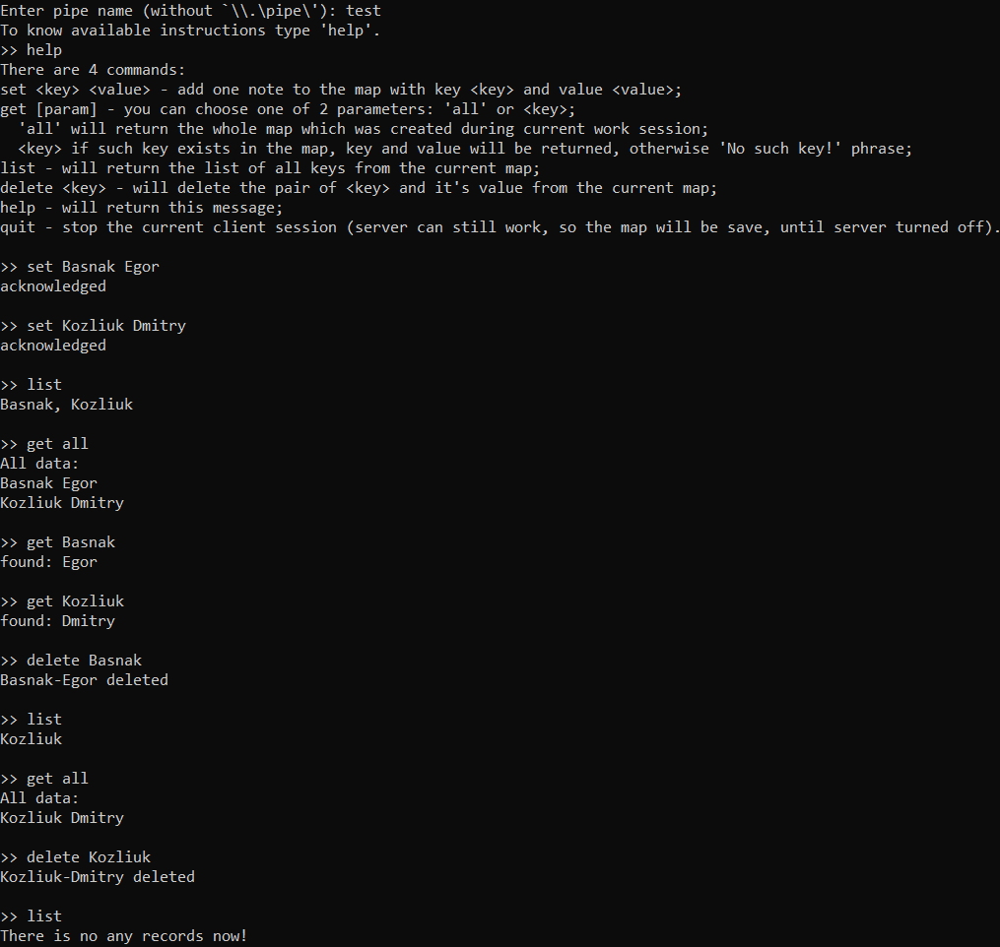
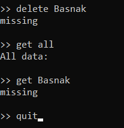
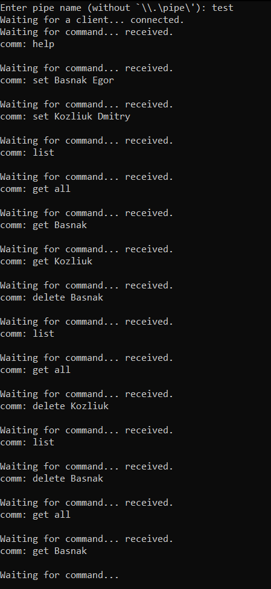
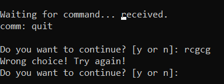

---

title: Отчет по ЛР №3

выполнил:

 студент: Баснак Е.А.
 группа: А-03-19

проверил:

 Козлюк Д.А.

---

# Задание на работу

Написать пару программ, взаимодействующих через именованные каналы. Программа-сервер хранит строки-значения по строкам-ключам. Программа-клиент, отправляя программе-серверу команды, добавляет, удаляет и получает значения.

# Выполнение работы

## Сервер

Задача сервера - создать именованный канал, дождаться подключения процесса-клиента, обработать запросы клиента и выдать необходимую информацию.

### Создание именованного канал

```cpp
printf("Enter pipe name (without `\\\\.\\pipe\\'): ");
    string name;
    cin >> name;

    // имя именованного канала
    auto path = "\\\\.\\pipe\\" + name;

    // создание именованного канала
    auto pipe = CreateNamedPipeA(path.c_str(),
                                 PIPE_ACCESS_DUPLEX,                // дуплексный режим открытия
                                 PIPE_TYPE_MESSAGE,                 // режим работы ориентированный на сообщения
                                 PIPE_UNLIMITED_INSTANCES,          // кол-во экземпляров ограничено возможностями системы
                                 BUF_SIZE2,                         // размер буфера передачи
                                 BUF_SIZE2,                         // размер буфера приема
                                 0,                                 // таймаут операций
                                 NULL);                             // атрибуты безопасности

    if (pipe == INVALID_HANDLE_VALUE)
    {
        printf("CreateNamedPipe Error: %d\n", GetLastError());
        return 1;
    }
```

---

### Основной цикл работы сервера

```cpp
    while (true)
    {
        map<string, int> keywords_int;
        keywords_int["set"] = 1;
        keywords_int["get"] = 2;
        keywords_int["help"] = 3;
        keywords_int["list"] = 4;
        keywords_int["delete"] = 5;
        keywords_int["quit"] = 6;

        printf("Waiting for a client... ");

        // подключению к клиенту
        fConnected = ConnectNamedPipe(pipe, NULL) ? TRUE : (GetLastError() == ERROR_PIPE_CONNECTED);

        if (fConnected)
        {
            printf("connected.\n");

            BOOL quit_flag = TRUE;

            while (quit_flag)
            {
                // чтение команды
                printf("Waiting for command... ");
                string command(64, '\0');

                if (!ReadFile(pipe, &command[0], command.size(), NULL, NULL))
                {
                    auto readError = GetLastError();
                    if (readError != ERROR_IO_PENDING)
                    {
                        printf("ReadFile Error: %d\n", readError);
                        CloseHandle(pipe);
                        return -3;
                    }
                }

                if (command[0] != '\0')
                    printf("received.\n");

                printf("comm: %s\n\n", command.c_str());

                istringstream parser{command};
                string keyword;
                parser >> keyword;

                // выбор действия в зависимости от полученной команды
                switch (keywords_int[keyword.c_str()])
                {
                    case 1:
                        if (!set_func(pipe, data, &parser))
                        {
                            printf("Set_func Error!\n");
                            CloseHandle(pipe);
                            return -2;
                        }
                        break;

                    case 2:
                        if (!get_func(pipe, data, &parser))
                        {
                            printf("Get_func Error!\n");
                            CloseHandle(pipe);
                            return -2;
                        }
                        break;

                    case 3:
                        if (!help_func(pipe))
                        {
                            printf("Help_func Error!\n");
                            CloseHandle(pipe);
                            return -2;
                        }
                        break;

                    case 4:
                        if (!list_func(pipe, data))
                        {
                            printf("List_func Error!\n");
                            CloseHandle(pipe);
                            return -2;
                        }
                        break;

                    case 5:
                        if (!delete_func(pipe, data, &parser))
                        {
                            printf("Delete_func Error!\n");
                            CloseHandle(pipe);
                            return -2;
                        }
                        break;

                    case 6:
                        if (!DisconnectNamedPipe(pipe))
                        {
                            printf("DisconnectNamedPipe Error: %d\n", GetLastError());
                            CloseHandle(pipe);
                            return -4;
                        }
                        quit_flag = FALSE;
                        break;

                    default:
                        char response[] = "No such command! Try again!\n";
                        if (!WriteFile(pipe, response, strlen(response), NULL, NULL))
                        {
                            auto writeError = GetLastError();
                            if (writeError != ERROR_IO_PENDING)
                            {
                                printf("WriteFile Error: %d", writeError);
                                CloseHandle(pipe);
                                return -2;
                            }
                        }
                        break;
                }
            }
        }
        else
        {
            CloseHandle(pipe);
            break;
        }

        // возможность продолжить работу сервера после отключения клиента
        string cont;
        while (true)
        {
            printf("Do you want to continue? [y or n]: ");
            cin >> cont;
            if (tolower(cont[0]) == 'n' or tolower(cont[0]) == 'y')
                break;
            else
                printf("Wrong choice! Try again!\n");
        }

        if (tolower(cont[0]) == 'n')
        {
            break;
        }
    }
```

---

## Функции

### set_func

```cpp
// функция для команды set
int set_func (HANDLE pipe, map<string, string> &data, istringstream *parser)
{
    string name;
    string value;
    *parser >> name >> value;

    data[name] = value;

    string response = "acknowledged\n";
    if (!WriteFile(pipe, response.c_str(), response.size(), NULL, NULL))
    {
        auto writeError = GetLastError();
        if (writeError != ERROR_IO_PENDING)
        {
            printf("WriteFile Error: %d", writeError);
            return 0;
        }
    }
    return 1;
}
```

---

### get_func

```cpp
// функция для команды get
int get_func (HANDLE pipe, map<string, string> data, istringstream *parser)
{
    string get_param;
    *parser >> get_param;

    char response[256] = "\0";


    if (strcmp(get_param.c_str(), "all") == 0)
    {
        strcpy(response, "All data:\n");

        for (auto item : data)
        {
            strcat(response, item.first.c_str());
            strcat(response, " ");
            strcat(response, item.second.c_str());
            strcat(response, "\n");
        }

    }
    else if (data.find(get_param.c_str()) != data.end())
    {
        strcat(response, "found: ");
        strcat(response, data[get_param.c_str()].c_str());
        strcat(response, "\n");
    }
    else
    {
        strcat(response, "missing\n");
    }

    if (!WriteFile(pipe, response, strlen(response), NULL, NULL))
    {
        auto writeError = GetLastError();
        if (writeError != ERROR_IO_PENDING)
        {
            printf("WriteFile Error: %d", writeError);
            return 0;
        }
    }
    return 1;
}
```

---

### help_func

```cpp
// функция для команды help
int help_func(HANDLE pipe)
{
    string response = "There are 4 commands:\n"
                      "set <key> <value> - add one note to the map with key <key> and value <value>;\n"
                      "get [param] - you can choose one of 2 parameters: 'all' or <key>;\n"
                      "  'all' will return the whole map which was created during current work session;\n"
                      "  <key> if such key exists in the map, key and value will be returned, otherwise 'No such key!' phrase;\n"
                      "list - will return the list of all keys from the current map;\n"
                      "delete <key> - will delete the pair of <key> and it's value from the current map;\n"
                      "help - will return this message;\n"
                      "quit - stop the current client session (server can still work, so the map will be save, until server turned off).\n";

    if (!WriteFile(pipe, response.c_str(), response.size(), NULL, NULL))
    {
        auto writeError = GetLastError();
        if (writeError != ERROR_IO_PENDING)
        {
            printf("WriteFile Error: %d", writeError);
            return 0;
        }
    }
    return 1;
}
```

---

### list_func

```cpp
// функция для команды list
int list_func(HANDLE pipe, map<string, string> data)
{
    string allList = "";

    for (auto item : data)
    {
        allList += item.first + ", ";
    }
    if (allList.length() == 0)
        allList = "There is no any records now!\n";
    else
    {
        allList[allList.length() - 2] = '\n';
        allList[allList.length() - 1] = '\0';
    }
    if (!WriteFile(pipe, allList.c_str(), allList.size(), NULL, NULL))
    {
        auto writeError = GetLastError();
        if (writeError != ERROR_IO_PENDING)
        {
            printf("WriteFile Error: %d", writeError);
            return 0;
        }
    }
    return 1;
}
```

---

### delete_func

```cpp
// функция для команды delete
int delete_func(HANDLE pipe, map<string, string> &data, istringstream *parser)
{
    string key;
    *parser >> key;

    char response[256] = "\0";
    auto delKeyIt = data.find(key.c_str());

    if (delKeyIt == data.end())
        strcat(response, "missing\n");
    else
    {
        strcat(response, key.c_str());
        strcat(response, "-");
        strcat(response, data[key.c_str()].c_str());
        strcat(response, " deleted\n");
        data.erase(delKeyIt);
    }

    if (!WriteFile(pipe, response, strlen(response), NULL, NULL))
    {
        auto writeError = GetLastError();
        if (writeError != ERROR_IO_PENDING)
        {
            printf("WriteFile Error: %d", writeError);
            return 0;
        }
    }
    return 1;
}
```

---

## Клиент


### Подключение к именованному каналу

```cpp
    printf("Enter pipe name (without `\\\\.\\pipe\\'): ");
    string name;
    cin >> name;
    getchar();

    auto path = "\\\\.\\pipe\\" + name;

    // подключение к именнованному каналу со стороны клиента
    auto client_pipe = CreateFileA(path.c_str(),
                                     GENERIC_READ | GENERIC_WRITE,  // режим доступа (чтение и запись)
                                     0,                             // разделение доступа
                                     NULL,                          // атрибуты безопасности
                                     OPEN_EXISTING,                 // подключение к существующему каналу
                                     FILE_ATTRIBUTE_NORMAL,         // отсутствие особых атрибутов у канала
                                     NULL);

    if (client_pipe == INVALID_HANDLE_VALUE)
    {
        printf("CreateFile Error: %d\n", GetLastError());
        return -5;
    }
```

---

### Основной цикл работы

```cpp
    while (true)
    {
        // отправка запроса серверу
        printf(">> ");

        string client_request = "";
        getline(cin, client_request);

        if (!WriteFile(client_pipe, client_request.c_str(), client_request.size(), NULL, NULL))
        {
            auto writeError = GetLastError();
            if (writeError != ERROR_IO_PENDING)
            {
                printf("WriteFile Error: %d", writeError);
                CloseHandle(client_pipe);
                return -2;
            }
        }

        // получение ответа от сервера
        if (client_request != "quit")
        {
            string client_response(1024, '\0');
            if (!ReadFile(client_pipe, &client_response[0], client_response.size(), NULL, NULL))
            {
                auto readError = GetLastError();
                if (readError != ERROR_IO_PENDING)
                {
                    printf("ReadFile Error: %d\n", readError);
                    CloseHandle(client_pipe);
                    return -3;
                }
            }

            printf("%s\n", client_response.c_str());
        }
        else
            break;

    }
```

---

## Пример работы программы

### Со стороны клиента




---

<br>

### Со стороны сервера




